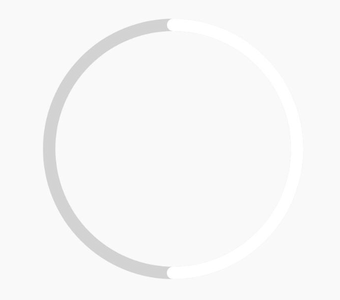

# rn-circular-progress

Circular progress bar for react native

<div align=center></div>

## Installation

```sh
npm i react-native-svg
npm i rn-circular-progress
```

## Usage

```js
import CircularProgress from 'rn-circular-progress';

// ...

<CircularProgress progress={50} />;
```

## Props

|Property|Type|Default|Description|
|:---|:---|:---|:---|
|style|[style](https://facebook.github.io/react-native/docs/view.html#style)|null|The style of external container.|
|radius|number|100|The radius of circle.|
|strokeWidth|number|10|The stoke width of circle.|
|strokeLinecap|Linecap|null|Shape of both ends.|
|backgroundTrackColor|string|'#d8d8d8'|Color of the background track.|
|trackColor|string|'#fff'|Color of progress bar.|
|progress|number|null|0-100|

## Contributing

See the [contributing guide](CONTRIBUTING.md) to learn how to contribute to the repository and the development workflow.

## License

MIT

---

Made with [create-react-native-library](https://github.com/callstack/react-native-builder-bob)
